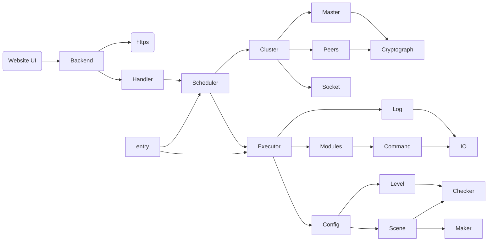
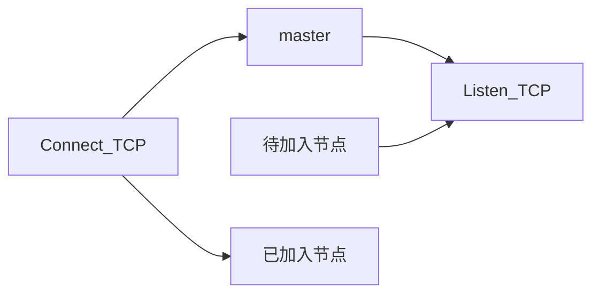

# 操作系统安全加固工具


# 文档

### 开发语言：

主要使用Golang作为主要开发语言，部分代码可采用嵌入C语言代码的方式执行。

Go + C https://www.cnblogs.com/linguanh/p/8323487.html

https://www.jianshu.com/p/ce97accb1801


### 集群管理：

主节点（Cluster Master）：serve port启动端口TCP监听节点加入，校验证书或密码，每个节点加入集群后分配单独的TCP连接。

节点（Peers）：通过join IP:port (pwd)的方式与master节点通信，经校验后分配TCP连接加入集群。

通信：使用非对称加密的方式加密对称加密密钥，完成密钥传输后正式加入集群，分发指令和收集返回值使用对称密钥进行加密。确保指令不能被转发执行。对加固目标进行RPC远程调用或者发送消息。


### 配置与日志：

配置文件存储到`/etc`目录下，以JSON格式记录连接的节点信息和创建的安全规则等，按照单条操作进行记录。

日志信息存储到`/var/log`目录下。master节点日志存储，记录peer节点执行结果；peer节点记录连接记录、指令执行历史和执行结果。

关于错误日志重定向：

https://blog.csdn.net/smilesundream/article/details/83867559

https://zhuanlan.zhihu.com/p/245369778


### 指令执行：

```Go
// Without result.
cmd := exec.Command("ls", "-a")
err := cmd.Run()
if nil ！= err {
    log.Fatal("Error: " + err.Error())
}

// With result.
cmd := exec.Command("ls", "-a")
out, err := cmd.ComninedOutput()
if nil != err {
    log.Panic("Error: " + err.Error())
}
fmt.Println(out)

// Pipe
c1 := exec.Command("grep", "ERROR", "/var/log/messages")
c2 := exec.Command("wc", "-l")
c2.Stdin, _ = c1.StdoutPipe()
c2.Stdout = os.Stdout
```


### 代码结构：



具体功能说明，大致按照实现优先级排序，Go Module代码结构：


IO包：实现基础的文件输入输出，用于设置文件和读写配置文件。

Log包：实现该程序的日志记录。

Command包：主要实现各种指令的执行的封装。

Modules各Module包：在不同的包下（如网络安全、用户权限等），实现各项配置指令执行的代码。

Executor包：实现命令行指令调用加固命令。单机命令行加固工具应从此处作为入口。


Checker包：完成对可检查加固项目的检查(Detect)。

Level包：根据信息安全技术网络安全等级保护基本要求设定预设配置。

Maker包：实现加固配置的创建。

Scene包：实现对用户自建加固场景的创建。

Config包：代码实现对信息安全技术网络安全等级保护基本要求和用户自定义配置的管理。


Cryptograph包：实现加密算法封装。

Socket包：实现TCP通信封装。

Master包：实现集群的主节点对应启动集群的相关功能。

Peers包：实现节点加入集群的相关功能。

Scheduler包：实现集群的通信调度，向选择的多个服务器进行某一种模式加固。

entry（main包）：完成命令行指令（包括集群服务和命令执行服务），集群命令行加固工具应从此处作为入口。


handler包：完成加固工具各功能的https方法。

https包：完成对Go net包的封装。

Backend：用户接口的后端服务入口。

Website UI：图形化用户接口。


### 网络结构



已加入的节点使用TCP连接进行通信，加固过程主进程使用Go协程向待加固机器发送指令。

主节点时时维护一个TCP连接为待加入节点提供验证服务。


Supervisor 守护进程。https://cloud.tencent.com/developer/article/1665596 (守护加固进程用，不过应该不需要，或者采取一个监听进程监听主进程)


### 已废弃

CP-ABE KP-ABE using in Communication and log system. 感觉不太能实现。

https://blog.csdn.net/jingzi123456789/article/details/104783728

https://cloud.tencent.com/developer/article/1682470

https://cloud.tencent.com/developer/article/1682597

[CP-ABE] http://acsc.cs.utexas.edu/cpabe/index.html


